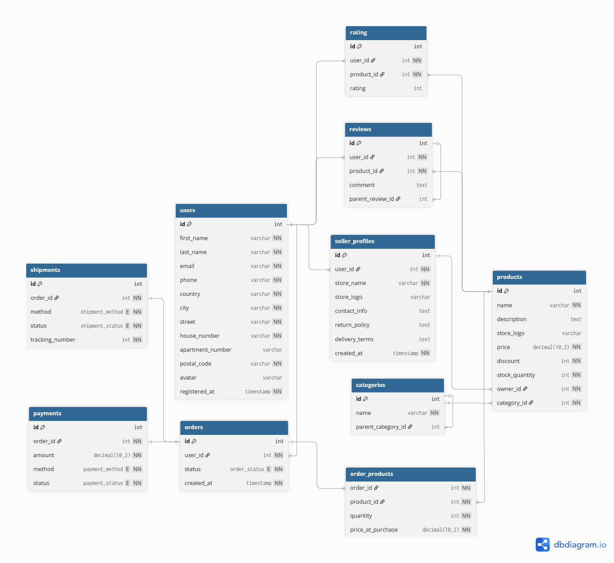

# Звіт: Лабораторна робота 1 (Проектування БД "Маркетплейс")

## 1. Вимоги

### Призначення системи

Система є **платформою-маркетплейсом**, яка дозволяє користувачам купувати та продавати товари. Вона має підтримувати реєстрацію користувачів, створення окремих профілів для продавців, каталог товарів з ієрархічними категоріями, процес оформлення замовлення, оплати, доставки, а також систему відгуків та рейтингів.

### Дані для зберігання

Система повинна зберігати наступні дані:
* **Інформація про користувачів:** Облікові дані, контактна інформація, адреса проживання та аватар.
* **Профілі продавців:** Окрема сутність для користувачів, які є продавцями, що містить назву магазину, логотип та юридичну інформацію (політики повернення, умови доставки).
* **Каталог товарів:** Назва товару, опис, ціна, знижка, кількість на складі, посилання на продавця та категорію.
* **Категорії:** Ієрархічна структура категорій (наприклад, "Одяг" -> "Чоловічий одяг" -> "Футболки").
* **Замовлення:** Інформація про замовлення, його статус та посилання на клієнта.
* **Склад замовлення:** Деталізація того, які товари, в якій кількості та за якою ціною (на момент покупки) були включені в кожне замовлення.
* **Відгуки та рейтинги:** Окремі сутності для текстових коментарів (з можливістю відповідей) та числових оцінок (рейтингів) для товарів.
* **Платежі та Доставки:** Окремі сутності для відстеження статусу оплати та доставки для кожного замовлення.

### Бізнес-правила

1.  Кожен користувач реєструється в системі з унікальною email-адресою.
2.  Користувач може стати продавцем, створивши один (і тільки один) профіль продавця.
3.  Продавець може додавати багато товарів, але кожен товар належить лише одному продавцю.
4.  Кожен товар має належати до однієї категорії.
5.  Категорії можуть мати батьківську категорію, створюючи деревоподібну структуру.
6.  Користувач може зробити багато замовлень. Кожне замовлення належить одному користувачу.
7.  Замовлення може містити декілька різних товарів, і один товар може бути в багатьох замовленнях (зв'язок "багато-до-багатьох").
8.  Ціна товару фіксується в таблиці `order_products` на момент покупки (`price_at_purchase`), щоб майбутні зміни цін в каталозі не впливали на історію замовлень.
9.  Кожне замовлення має рівно один платіж та одну доставку.
10. Користувачі можуть залишати відгуки та рейтинги до товарів.
11. Користувач може оцінити один і той самий товар (поставити рейтинг) лише один раз.
12. Відгуки (коментарі) можуть мати ієрархію "відповідей", посилаючись на `parent_review_id`.

---

## 2. ER-діаграма

---

## 3. Сутності, атрибути та зв'язки

### Список сутностей та атрибутів

* **users** (Користувачі)
    * `id` (PK): Ідентифікатор.
    * `first_name`, `last_name`: Ім'я та прізвище.
    * `email` (Unique): Електронна пошта.
    * `phone`: Телефон.
    * `country`, `city`, `street`, `house_number`, `apartment_number`, `postal_code`: Адреса.
    * `avatar`: URL аватара.
    * `registered_at`: Час реєстрації.
* **categories** (Категорії)
    * `id` (PK): Ідентифікатор.
    * `name`: Назва категорії.
    * `parent_category_id` (FK): Посилання на батьківську категорію.
* **seller\_profiles** (Профілі продавців)
    * `id` (PK): Ідентифікатор.
    * `user_id` (FK, Unique): Посилання на користувача.
    * `store_name`, `store_logo`: Назва та логотип магазину.
    * `contact_info`, `return_policy`, `delivery_terms`: Додаткова інформація.
    * `created_at`: Час створення.
* **products** (Товари)
    * `id` (PK): Ідентифікатор.
    * `name`, `description`: Назва та опис.
    * `price`, `discount`, `stock_quantity`: Ціна, знижка, залишок на складі.
    * `owner_id` (FK): Посилання на профіль продавця.
    * `category_id` (FK): Посилання на категорію.
* **orders** (Замовлення)
    * `id` (PK): Ідентифікатор.
    * `user_id` (FK): Посилання на користувача, що зробив замовлення.
    * `status`: Статус замовлення (NEW, PAID тощо).
    * `created_at`: Час створення.
* **order\_products** (Асоціативна сутність "Товари в замовленні")
    * `order_id` (PK, FK): Посилання на замовлення.
    * `product_id` (PK, FK): Посилання на товар.
    * `quantity`: Кількість одиниць товару.
    * `price_at_purchase`: Зафіксована ціна на момент покупки.
* **reviews** (Відгуки)
    * `id` (PK): Ідентифікатор.
    * `user_id` (FK): Посилання на автора відгуку.
    * `product_id` (FK): Посилання на товар.
    * `comment`: Текстовий коментар.
    * `parent_review_id` (FK): Посилання на батьківський відгук (для відповідей).
* **rating** (Рейтинги)
    * `id` (PK): Ідентифікатор.
    * `user_id` (FK): Посилання на автора оцінки.
    * `product_id` (FK): Посилання на товар.
    * `rating`: Числова оцінка (напр., 1-5).
* **payments** (Платежі)
    * `id` (PK): Ідентифікатор.
    * `order_id` (FK, Unique): Посилання на замовлення.
    * `amount`: Сума платежу.
    * `method`, `status`: Метод та статус платежу.
* **shipments** (Доставки)
    * `id` (PK): Ідентифікатор.
    * `order_id` (FK, Unique): Посилання на замовлення.
    * `method`, `status`: Метод та статус доставки.
    * `tracking_number`: Трекінг-номер.

### Пояснення зв'язків

* **users ↔ seller\_profiles** (Один-до-одного): Один `user` може мати один `seller_profile`. Це реалізовано через `UNIQUE` обмеження на `user_id` в таблиці `seller_profiles`.
* **seller\_profiles → products** (Один-до-багатьох): Один `seller_profile` (продавець) може мати багато `products`, але кожен `product` належить одному продавцю.
* **users → orders** (Один-до-багатьох): Один `user` може зробити багато `orders`, але кожне `order` належить одному користувачу.
* **users → reviews** (Один-до-багатьох): Один `user` може написати багато `reviews`.
* **users ↔ products (через rating)** (Багато-до-багатьох з умовою): Один `user` може оцінити багато `products`, але він може оцінити *конкретний* товар лише один раз.
* **categories ↔ categories** (Рекурсивний Один-до-багатьох): Одна `category` може мати одну `parent_category_id`, що дозволяє створювати ієрархію.
* **categories → products** (Один-до-багатьох): В одній `category` може бути багато `products`, але кожен `product` належить одній категорії.
* **products → reviews** (Один-до-багатьох): Один `product` може мати багато `reviews`.
* **reviews ↔ reviews** (Рекурсивний Один-до-багатьох): Один `review` може мати багато відповідей (інших відгуків, що посилаються на нього як на `parent_review_id`).
* **orders ↔ products (через order\_products)** (Багато-до-багатьох): Одне `order` може містити багато `products`, і один `product` може бути в багатьох `orders`. Це реалізовано через асоціативну таблицю `order_products`.
* **orders ↔ payments** (Один-до-одного): Одне `order` має рівно один `payment`.
* **orders ↔ shipments** (Один-до-одного): Одне `order` має рівно одну `shipment`.

---

## 4. Припущення та обмеження

1. **Одна адреса**: Користувач може зберігати лише одну адресу у своєму профілі. Система не підтримує книгу адрес.
2. **Анонімні відгуки**: Якщо користувач видаляє свій акаунт, його текстові відгуки залишаються, але стають анонімними. Його рейтинги видаляються.
3. **Фіксована ціна**: Ціна товару та знижка фіксуються на момент додавання товару в кошик (зберігаються в таблиці order_products), що захищає від змін цін після оформлення замовлення.
4. **Видалення**: Заборонено видаляти категорії, в яких є товари, або користувачів, які мають замовлення, для збереження цілісності даних.