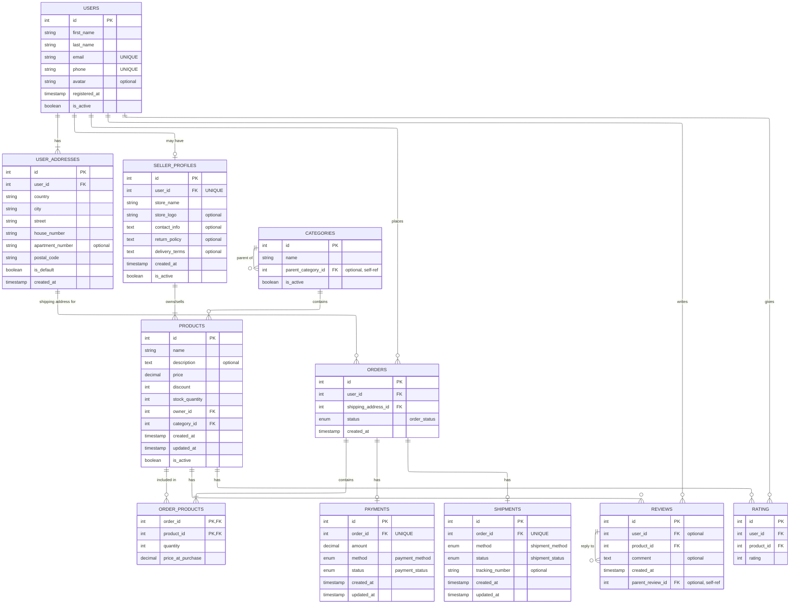

```mermaid
---
config:
  layout: elk
---
erDiagram
    USERS {
        int id PK
        string first_name
        string last_name
        string email "UNIQUE"
        string phone "UNIQUE"
        string avatar "optional"
        timestamp registered_at
        boolean is_active
    }

    USER_ADDRESSES {
        int id PK
        int user_id FK
        string country
        string city
        string street
        string house_number
        string apartment_number "optional"
        string postal_code
        boolean is_default
        timestamp created_at
    }

    SELLER_PROFILES {
        int id PK
        int user_id FK "UNIQUE"
        string store_name
        string store_logo "optional"
        text contact_info "optional"
        text return_policy "optional"
        text delivery_terms "optional"
        timestamp created_at
        boolean is_active
    }

    CATEGORIES {
        int id PK
        string name
        int parent_category_id FK "optional, self-ref"
        boolean is_active
    }

    PRODUCTS {
        int id PK
        string name
        text description "optional"
        decimal price
        int discount
        int stock_quantity
        int owner_id FK
        int category_id FK
        timestamp created_at
        timestamp updated_at
        boolean is_active
    }

    ORDERS {
        int id PK
        int user_id FK
        int shipping_address_id FK
        enum status "order_status"
        timestamp created_at
    }

    ORDER_PRODUCTS {
        int order_id PK, FK
        int product_id PK, FK
        int quantity
        decimal price_at_purchase
    }

    PAYMENTS {
        int id PK
        int order_id FK "UNIQUE"
        decimal amount
        enum method "payment_method"
        enum status "payment_status"
        timestamp created_at
        timestamp updated_at
    }

    SHIPMENTS {
        int id PK
        int order_id FK "UNIQUE"
        enum method "shipment_method"
        enum status "shipment_status"
        string tracking_number "optional"
        timestamp created_at
        timestamp updated_at
    }

    REVIEWS {
        int id PK
        int user_id FK "optional"
        int product_id FK
        text comment "optional"
        timestamp created_at
        int parent_review_id FK "optional, self-ref"
    }

    RATING {
        int id PK
        int user_id FK
        int product_id FK
        int rating
    }

    USERS ||--|{ USER_ADDRESSES : "has"
    USERS ||--o| SELLER_PROFILES : "may have"
    SELLER_PROFILES ||--|{ PRODUCTS : "owns/sells"
    CATEGORIES ||--o{ CATEGORIES : "parent of"
    CATEGORIES ||--o{ PRODUCTS : "contains"
    USERS ||--o{ ORDERS : "places"
    USER_ADDRESSES ||--o{ ORDERS : "shipping address for"
    ORDERS ||--|{ ORDER_PRODUCTS : "contains"
    PRODUCTS ||--o{ ORDER_PRODUCTS : "included in"
    ORDERS ||--o| PAYMENTS : "has"
    ORDERS ||--o| SHIPMENTS : "has"
    USERS ||--o{ REVIEWS : "writes"
    USERS ||--o{ RATING : "gives"
    PRODUCTS ||--o{ REVIEWS : "has"
    PRODUCTS ||--o{ RATING : "has"
    REVIEWS ||--o{ REVIEWS : "reply to"
```