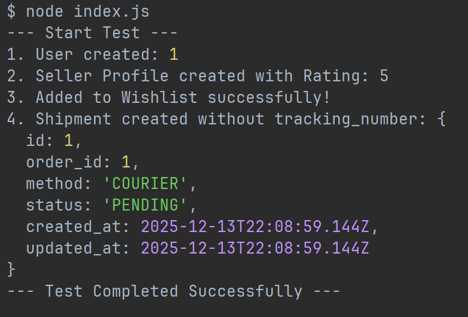

# Migrations (Lab 6)

## 1. Ініціалізація (Introspection & Init)

**Команда:** `npx prisma db pull` та `npx prisma migrate dev --name init`

**Опис:**
Схему було зчитано з існуючої бази даних (Lab 5). Створено початкову міграцію, яка фіксує базовий стан таблиць (`users`, `products`, `orders` тощо).

## 2. Міграція: Додавання таблиці (`add_wishlist_table`)

**Команда:** `npx prisma migrate dev --name add_wishlist_table`

**Опис:**
Додано нову сутність **Wishlist** для зберігання списку бажань користувачів. Реалізовано зв'язок "багато-до-одного" з таблицями `users` та `products`.

### Зміни в `schema.prisma`:

**До:**
*(Таблиця відсутня)*

**Після:**

```prisma
// Додано нову модель
model Wishlist {
  id         Int      @id @default(autoincrement())
  user_id    Int
  product_id Int
  added_at   DateTime @default(now())
  user       users    @relation(fields: [user_id], references: [id], onDelete: Cascade)
  product    products @relation(fields: [product_id], references: [id], onDelete: Cascade)

  @@unique([user_id, product_id])
  @@map("wishlists")
}

// Оновлено модель users
model users {
  // ... існуючі поля
  wishlist        Wishlist[] // <-- Новий зв'язок
}

// Оновлено модель products
model products {
  // ... існуючі поля
  wishlist        Wishlist[] // <-- Новий зв'язок
}
```

## 3. Міграція: Додавання поля (`add_seller_rating`)

**Команда:** `npx prisma migrate dev --name add_seller_rating`

**Опис:**
До таблиці профілів продавців (`seller_profiles`) додано поле `rating` для відображення рейтингу магазину. Встановлено значення за замовчуванням `0.0`.

### Зміни в `schema.prisma`:

**До:**

```prisma
model seller_profiles {
  id             Int        @id @default(autoincrement())
  store_name     String     @db.VarChar(255)
  // ...
  created_at     DateTime   @default(now()) @db.Timestamp(6)
}
```

**Після:**

```prisma
model seller_profiles {
  id             Int        @id @default(autoincrement())
  store_name     String     @db.VarChar(255)
  // ...
  rating         Decimal    @default(0.0) @db.Decimal(3, 2) // <-- Додане поле
  created_at     DateTime   @default(now()) @db.Timestamp(6)
}
```

## 4. Міграція: Видалення стовпця (`drop_tracking_number`)

**Команда:** `npx prisma migrate dev --name drop_tracking_number`

**Опис:**
З таблиці `shipments` видалено поле `tracking_number` (наприклад, для рефакторингу або перенесення логіки відстеження в окремий сервіс).

### Зміни в `schema.prisma`:

**До:**

```prisma
model shipments {
  id              Int             @id @default(autoincrement())
  status          shipment_status @default(PENDING)
  tracking_number String?         @db.VarChar(100) // <-- Це поле існувало
  created_at      DateTime        @default(now()) @db.Timestamp(6)
}
```

**Після:**

```prisma
model shipments {
  id              Int             @id @default(autoincrement())
  status          shipment_status @default(PENDING)
  // tracking_number видалено
  created_at      DateTime        @default(now()) @db.Timestamp(6)
}
```

## 5. Перевірка результатів (Verification)

Для перевірки змін було написано скрипт `index.js`, який:

1.  Очищає базу даних.
2.  Створює користувача та продавця з **новим полем `rating`**.
3.  Додає товар у **нову таблицю `Wishlist`**.
4.  Створює запис `shipments` і перевіряє відсутність поля `tracking_number`.

### Результат виконання:

